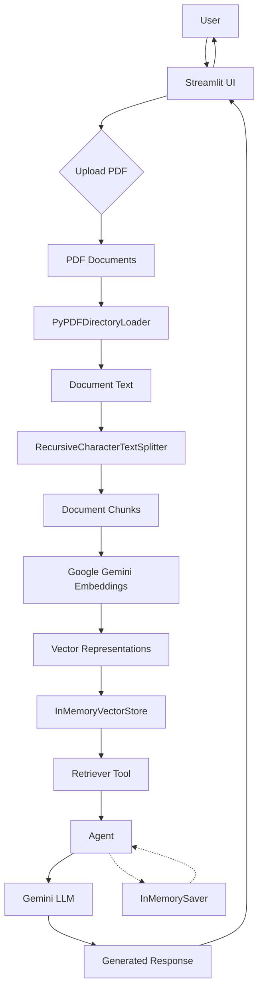

# 🧠 DocuMind — Agentic AI RAG Document Assistant

DocuMind is an **Agentic AI-powered Retrieval-Augmented Generation (RAG) application** that allows users to upload PDF documents and interact with them through natural-language conversations.

Instead of relying only on the language model's pretrained knowledge, DocuMind retrieves relevant information from the uploaded documents using **semantic vector search** and provides that context to a Gemini-powered AI agent before generating a response.

The application is built with **LangChain, LangGraph, Google Gemini, vector embeddings, Streamlit, and Python**.

---

## ✨ Features

* 📄 Upload one or multiple PDF documents
* 🔎 Semantic search over document content
* 🤖 Agentic AI architecture with tool calling
* 🧠 Retrieval-Augmented Generation (RAG)
* 🔢 Gemini-based document embeddings
* 💬 Conversational question answering
* 🗂️ In-memory vector storage
* 🧩 LangChain agent orchestration
* 🧠 LangGraph checkpoint-based conversation state
* ⚡ Streamlit interactive interface
* 🔐 Environment-based API key configuration

---

# 🏗️ System Architecture



---

# 🔄 RAG + Agentic Workflow

DocuMind follows the following pipeline:

### 1. Document Upload

The user uploads PDF documents through the Streamlit interface.

```text
User
 ↓
Streamlit File Uploader
 ↓
PDF Files
```

The uploaded files are stored locally and processed by the document pipeline.

---

### 2. PDF Loading

`PyPDFDirectoryLoader` loads the PDF documents and extracts their textual content.

```text
PDF
 ↓
PyPDFDirectoryLoader
 ↓
Documents
```

---

### 3. Text Chunking

Large documents are divided into smaller chunks using:

```python
RecursiveCharacterTextSplitter(
    chunk_size=1000,
    chunk_overlap=200
)
```

The overlap helps preserve contextual information between neighboring chunks.

```text
Document
 ↓
Chunk 1
Chunk 2
Chunk 3
...
```

---

### 4. Embedding Generation

Each document chunk is converted into a vector representation using Google's Gemini embedding model.

```text
Text Chunk
    ↓
Gemini Embedding Model
    ↓
Vector Representation
```

These vectors allow the system to perform semantic similarity search rather than relying only on keyword matching.

---

### 5. Vector Storage

The generated embeddings are stored in an in-memory vector store.

```text
Document Chunks
      +
Embeddings
      ↓
InMemoryVectorStore
```

The vector store acts as the knowledge base for the uploaded documents.

---

### 6. Agentic Retrieval

DocuMind exposes document retrieval as a tool available to the AI agent.

```python
@tool
def retrieve_tool(query: str):
    ...
```

When the user asks a question related to the uploaded document, the agent can invoke the retrieval tool.

```text
User Question
      ↓
Gemini Agent
      ↓
Retrieve Tool
      ↓
Similarity Search
      ↓
Relevant Document Chunks
      ↓
Gemini Agent
      ↓
Final Answer
```

This makes the system **agentic**, because the language model can decide when to use the retrieval tool rather than having retrieval hard-coded directly into every interaction.

---

# 🤖 Agent Architecture

The core agent is created using LangChain:

```python
agent = create_agent(
    tools=[retrieve_tool],
    model=llm,
    system_prompt=system_prompt,
    checkpointer=memory
)
```

The agent consists of:

```text
┌─────────────────────────────┐
│         Gemini LLM          │
└──────────────┬──────────────┘
               │
               ▼
┌─────────────────────────────┐
│       LangChain Agent       │
│                             │
│  Decides whether retrieval  │
│  is required                │
└──────────────┬──────────────┘
               │
               ▼
┌─────────────────────────────┐
│       retrieve_tool         │
└──────────────┬──────────────┘
               │
               ▼
┌─────────────────────────────┐
│    InMemoryVectorStore      │
└──────────────┬──────────────┘
               │
               ▼
       Relevant Context
               │
               ▼
┌─────────────────────────────┐
│       Gemini LLM            │
│   Context + User Query      │
└──────────────┬──────────────┘
               │
               ▼
          Final Answer
```

---

# 💬 Conversation Flow

For every user query:

```text
User
 │
 ▼
Streamlit Chat Interface
 │
 ▼
LangChain Agent
 │
 ├── Does the question require document information?
 │
 └── Yes
      │
      ▼
  retrieve_tool
      │
      ▼
 Vector Similarity Search
      │
      ▼
 Relevant Context
      │
      ▼
 Gemini LLM
      │
      ▼
 Generated Answer
      │
      ▼
 Streamlit
```

---

# 🧩 Technology Stack

| Component                  | Technology                         |
| -------------------------- | ---------------------------------- |
| Language                   | Python                             |
| UI                         | Streamlit                          |
| LLM                        | Google Gemini                      |
| Embeddings                 | Google Gemini Embeddings           |
| Agent Framework            | LangChain                          |
| Agent Runtime              | LangGraph                          |
| PDF Processing             | PyPDFLoader / PyPDFDirectoryLoader |
| Text Splitting             | RecursiveCharacterTextSplitter     |
| Vector Store               | InMemoryVectorStore                |
| Conversation Checkpointing | LangGraph InMemorySaver            |
| Environment Management     | python-dotenv                      |

---

# 📁 Project Structure

```text
DocuMind/
│
├── app.py
├── requirements.txt
├── .env
├── .gitignore
│
├── doc_files/
│   └── uploaded_pdfs/
│
└── README.md
```

> API keys and other secrets should be stored in `.env` and excluded from version control.

---

# ⚙️ Installation

## 1. Clone the repository

```bash
git clone https://github.com/shirshanag/DocuMind.git
cd DocuMind
```

---

## 2. Create a virtual environment

### Windows

```powershell
python -m venv venv
```

Activate it:

```powershell
venv\Scripts\activate
```

---

## 3. Install dependencies

```powershell
pip install -r requirements.txt
```

---

## 4. Configure environment variables

Create a `.env` file:

```env
GOOGLE_API_KEY=your_google_api_key
```

Do not commit the `.env` file to GitHub.

Add it to `.gitignore`:

```text
.env
venv/
__pycache__/
*.pyc
```

---

# ▶️ Running the Application

Start the Streamlit application:

```powershell
python -m streamlit run app.py
```

The application will open in your browser.

Then:

```text
Upload PDF
    ↓
Document Processing
    ↓
Chunking
    ↓
Embedding Generation
    ↓
Vector Store
    ↓
Agent Ready
    ↓
Ask Questions
```

---

# 🧪 Example Interaction

### User

```text
What are the main findings mentioned in the document?
```

### Internal workflow

```text
Question
   ↓
Agent
   ↓
retrieve_tool
   ↓
Semantic Search
   ↓
Top Relevant Chunks
   ↓
Gemini
   ↓
Answer
```

### User

```text
Summarize the treatment recommendations.
```

The agent retrieves the relevant sections of the document and uses them as context when generating the response.

---

# 🧠 Why RAG?

A standard LLM answers questions primarily from its pretrained knowledge.

DocuMind adds an external knowledge layer:

```text
             ┌───────────────┐
             │   Gemini LLM  │
             └───────┬───────┘
                     │
              Generated Answer
                     ▲
                     │
              Retrieved Context
                     ▲
                     │
             Semantic Search
                     ▲
                     │
             Vector Database
                     ▲
                     │
             Uploaded Documents
```

This allows the application to answer questions using information contained in the user's documents rather than relying exclusively on the model's pretrained knowledge.

---

# 🔧 Key Components

## PyPDFDirectoryLoader

Loads PDF files from the document directory and converts them into LangChain documents.

## RecursiveCharacterTextSplitter

Splits large documents into manageable chunks while maintaining contextual overlap.

## GoogleGenerativeAIEmbeddings

Converts document chunks into numerical vector representations for semantic retrieval.

## InMemoryVectorStore

Stores document embeddings and performs similarity search against user queries.

## Retrieval Tool

Provides the agent with access to the document knowledge base.

## LangChain Agent

Coordinates the LLM and retrieval tool to determine when document retrieval should be used.

## LangGraph InMemorySaver

Provides checkpoint-based state management for the agent's conversation thread during the application's runtime.

---

# 🚀 Future Improvements

Potential improvements include:

* Persistent vector database such as Chroma or FAISS
* Persistent conversation storage
* Streaming model responses
* Source citations for retrieved chunks
* Page-number references in answers
* Improved multi-document management
* Document metadata filtering
* Authentication and user-specific document collections
* Hybrid keyword + semantic retrieval
* Reranking retrieved documents
* Production deployment with Docker
* Cloud-based document storage
* Evaluation using RAG-specific metrics

---

# 📌 Current Limitations

* Vector storage is currently in-memory.
* Conversation state is not intended for permanent storage.
* Uploaded documents are processed locally.
* The application currently focuses on PDF-based knowledge retrieval.
* Retrieval quality depends on document chunking, embeddings, and similarity search.

---

# 🎯 Project Highlights

**DocuMind demonstrates practical implementation of:**

* Retrieval-Augmented Generation
* Agentic AI
* Tool Calling
* Semantic Search
* Vector Embeddings
* LLM Application Development
* Document Intelligence
* Conversational AI
* LangChain Agent Architecture
* Streamlit Application Development

---

## 👨‍💻 Author

**Shirsha Nag**

B.Tech — Computer Science & Engineering
AI/ML • Generative AI • Agentic AI • RAG

GitHub: `https://github.com/shirshanag`

---

## 📜 License

This project is intended for educational and research purposes.
